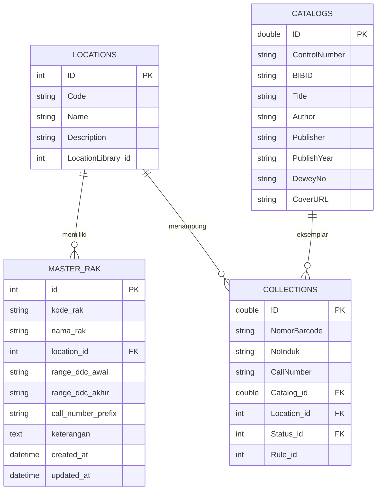

# Database Schema & Relationships — INLISLite v3 Perpustakaan UT

Dokumentasi ini adalah Single Source of Truth untuk skema database `dbsirkulasi` yang digunakan di Perpustakaan Pusat Universitas Terbuka.

## 1. ERD Relasi Lokasi, Rak, dan Koleksi Buku

## 2. Daftar Tabel & Penjelasan

### `master_rak`
Tabel entitas rak fisik perpustakaan yang dipetakan ke ruangan lantai (`locations`) dan rentang nomor DDC / Call Number.
- `id` (INT, PK): Identifier unik rak
- `kode_rak` (VARCHAR 50, UNIQUE): Kode fisik rak (contoh: RAK-L2-01)
- `nama_rak` (VARCHAR 255): Nama deskriptif rak (contoh: Rak 01 - Ilmu Sosial & Ekonomi)
- `location_id` (INT, FK): Relasi ke `locations.ID` (Lantai / Ruangan)
- `range_ddc_awal` (VARCHAR 20): Batas bawah nomor DDC (contoh: 330)
- `range_ddc_akhir` (VARCHAR 20): Batas atas nomor DDC (contoh: 339.99)
- `call_number_prefix` (VARCHAR 50): Prefix nomor panggil khusus (contoh: FP untuk Fiksi)
- `keterangan` (TEXT): Posisi fisik detail di lorong rak

### `locations`
Tabel master ruangan / lantai perpustakaan (Lobby Lantai 1, Ruang Baca Lantai 2, Lantai 3, Lantai 4, dll.).
- `ID` (INT, PK)
- `Code` (VARCHAR 10)
- `Name` (VARCHAR 255)
- `Description` (VARCHAR 255)
- `LocationLibrary_id` (INT)

### `collections`
Tabel eksemplar fisik buku perpustakaan.
- `ID` (DOUBLE, PK)
- `NomorBarcode` (VARCHAR 50): Barcode eksemplar
- `CallNumber` (VARCHAR 255): Nomor panggil lengkap pada punggung buku
- `Catalog_id` (DOUBLE, FK): Relasi ke data bibliografis katalog
- `Location_id` (INT, FK): Relasi ke ruangan lantai (`locations`)
- `Status_id` (INT, FK): Status buku (Tersedia, Dipinjam, dll.)

### `catalogs`
Tabel metadata bibliografis buku berdasarkan standar MARC21.
- `ID` (DOUBLE, PK)
- `Title` (VARCHAR 255): Judul buku
- `Author` (VARCHAR 255): Pengarang buku
- `Publisher` (VARCHAR 255): Penerbit
- `PublishYear` (VARCHAR 45): Tahun terbit
- `DeweyNo` (VARCHAR 255): Nomor klasifikasi Dewey Decimal (DDC)
- `CoverURL` (VARCHAR 255): Tautan sampul buku digital